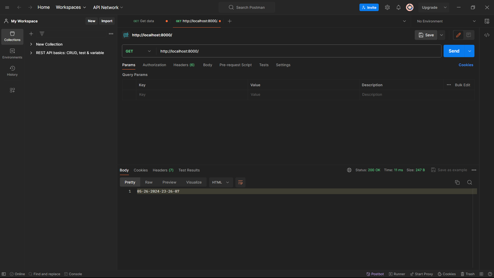

# NodeJs Task 1

## NodeJS

- Node.js is an _open-source, cross-platform JavaScript runtime environment_ that allows developers to `run JavaScript code outside of a web browser.`
- It is designed to be **efficient and scalable**, making it well-suited for `building server-side` and `networked applications.`
- **Node.js is built on the V8 JavaScript engine,** the same engine that powers Google Chrome, and it uses a `non-blocking,` event-driven architecture that makes it ideal for handling _asynchronous tasks_ and I/O operations.

### You can View the TimeStramp By using the EndPoint /write and /read

## Using Inbuilt Functions

- fs.writeFileSync(filePath,timeStamp,'utf8')
- fs.readFileSync(filePath,'utf8')

## IN Postman

## Deployed Server In Render

[Demo Link in Render](/)

## Technology Used

 </a> <a href="https://www.rust-lang.org" target="_blank" rel="noreferrer">
